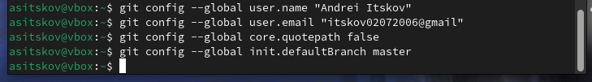
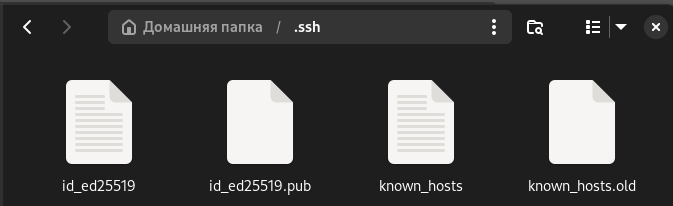
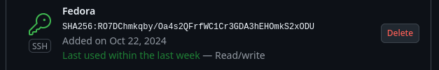
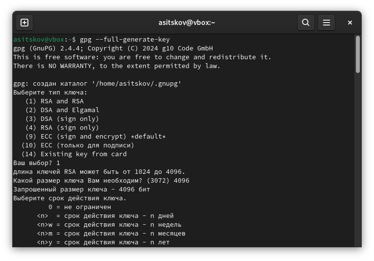
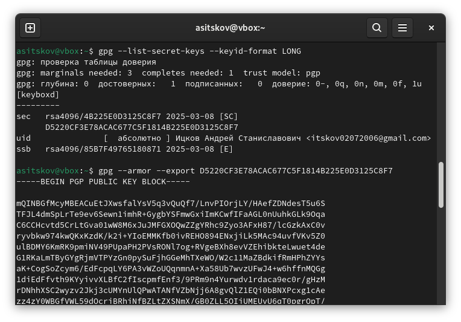
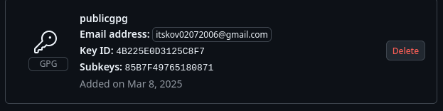
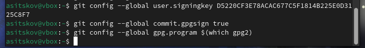
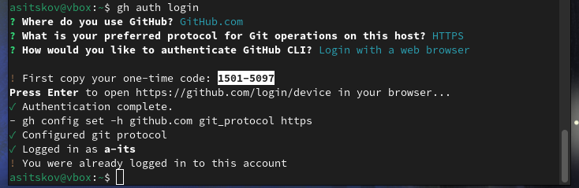
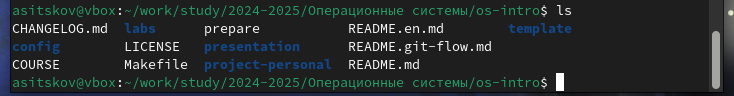
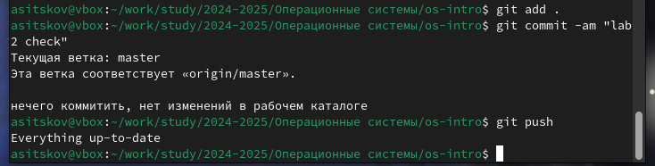

---
## Front matter
lang: ru-RU
title: Отчет по лабораторной работе №2
subtitle: Операционные системы
author:
  - Ицков А.С.
institute:
  - Российский университет дружбы народов, Москва, Россия

## i18n babel
babel-lang: russian
babel-otherlangs: english

## Formatting pdf
toc: false
toc-title: Содержание
slide_level: 2
aspectratio: 169
section-titles: true
theme: metropolis
header-includes:
 - \metroset{progressbar=frametitle,sectionpage=progressbar,numbering=fraction}
---

# Информация

## Докладчик

:::::::::::::: {.columns align=center}
::: {.column width="70%"}

  * Ицков Андрей Станиславович
  * НКАбд-02-2024 № Студенческого билета: 1132246737
  * Российский университет дружбы народов
  * <https://github.com/a-its/study_2024-2025_os-intro>

:::
::: {.column width="30%"}

:::
::::::::::::::

# Цель работы

Целью данной работы является изучение идеологии и применения средств контроля версий и освоение умения по работе с git.

# Задание

1. Создать базовую конфигурацию для работы с git.
2. Создать ключ SSH.
3. Создать ключ PGP.
4. Настроить подписи git.
5. Зарегистрироваться на Github.
6. Создать локальный каталог для выполнения заданий по предмету.

# Теоретическое введение

Системы контроля версий (Version Control System, VCS) применяются при работе нескольких человек над одним проектом. Обычно основное дерево проекта хранится в локальном или удалённом репозитории, к которому настроен доступ для участников проекта. При внесении изменений в содержание проекта система контроля версий позволяет их фиксировать, совмещать изменения, произведённые разными участниками проекта, производить откат к любой более ранней версии проекта, если это требуется.

# Выполнение лабораторной работы

## Установка git и gh

Установим гит командой dnf install git, установим gh командой dnf install gh

## Базовая настройка git.

Открываем терминал. При помощи команд git config --global user.name и git config --global user.email зададим имя пользователя и адрес электронной почты. При помощи команды git config --global core.quotepath false настроим utf-8 в выводе сообщений git. При помощи команды git config --global init.defaultBranch master зададим начальной ветке имя master.

{#fig:001 width=70%}

## Создание ssh ключа.

Для создания ключа используем команду ssh-keygen -t в терминале. Зададим ключу размер 4096 бит. Сменим пароль при помощи команды ssh-keygen -p.

{#fig:002 width=70%}

## Добавление ssh-ключа в учетную запись ГитХаб.

Копируем созданный ключ и переносим его на сайт гитхаб в раздел ssh и gpg keys.

Создаем новый ключ, задаем ему название и переносим ключ в поле key, добавляем ключ на сайт. 

##

{#fig:003 width=70%}

## Создание PGP ключа.

Генерируем ключ командой gpg --full-generate-key, настраиваем его по заданным требованиям.

{#fig:004 width=70%}

##

Выводим ключ в терминал командой gpg --list-secret-keys --keyid-format LONG. После этого экспортируем его командой gpg --armor --export.

{#fig:005 width=70%}

## Добавление ключа на ГитХаб.

Скопировав ключ, переносим его на ГитХаб, создаем на сайте новый ключ и вставляем скопированный ключ в необходимое поле.

{#fig:006 width=70%}

## Настройка автоматических подписей коммитов git

При помощи команд git config --global user.signingkey, git config --global commit.gpgsign true и git config --global gpg.program $(which gpg2) самостоятельно выбираем подписи коммитов в git.

{#fig:007 width=70%}

## Настройка gh

Введя в терминал команду gh auth login, ответим на необходимые в терминале вопросы, после чего авторизуемся через браузер.

{#fig:008 width=70%}

## Создание и настройка репозитория курса.

Используя команды mkdir, gh repo, create study и git clone создаем репозиторий курса. 

{#fig:009 width=70%}

Отправляем файлы первой лабораторной работы на сервер.

##

{#fig:010 width=70%}

# Вывод

В результате выполнения данной лабораторной работы я приобрел необходимые навыки работы с гит, научился созданию репозиториев, gpg и ssh ключей, настроил каталог курса и  авторизовался в gh.
